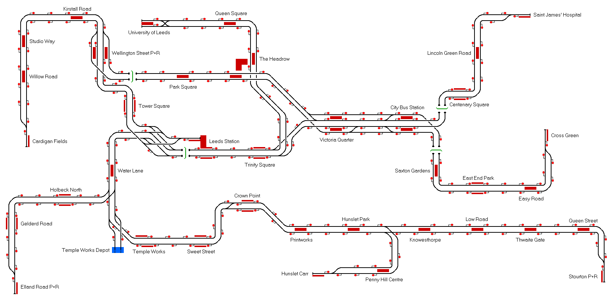

# Leeds Light Metro 
A fictional light rail network in and around Leeds, West Yorkshire, based loosely on London's Docklands Light Railway.

## Current Status

| Stage         | Status        |
| ------------- |:-------------:|
| Track Plan     | :heavy_check_mark: |
| Signalling      | :heavy_check_mark:      |
| Naming | :heavy_check_mark:      |
| Speed Limits | :heavy_check_mark: |
| Distances | :heavy_check_mark: |
| Timetable | :x: |
| Documentation | :x: |

## Data Sources

- [OpenStreetMap](https://www.openstreetmap.org/#map=14/53.7939/-1.5432)
